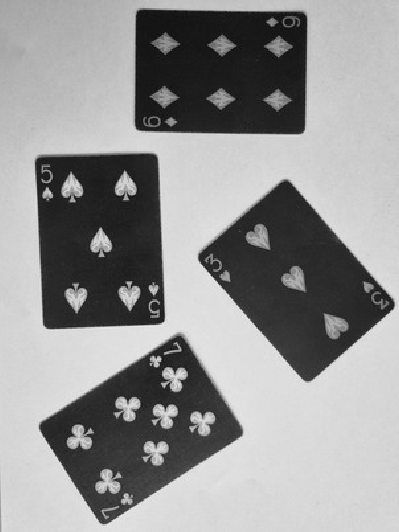
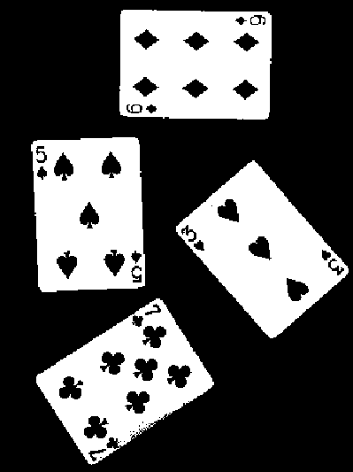
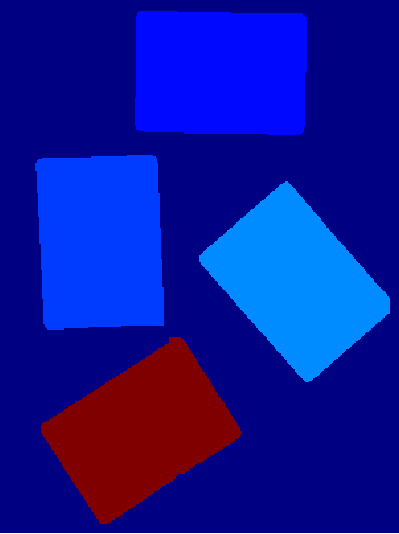
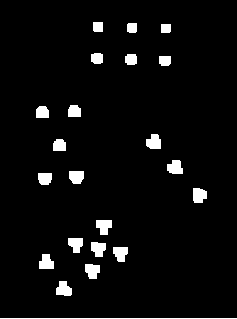
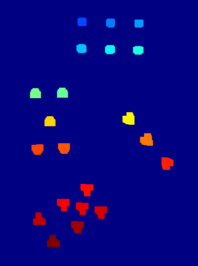
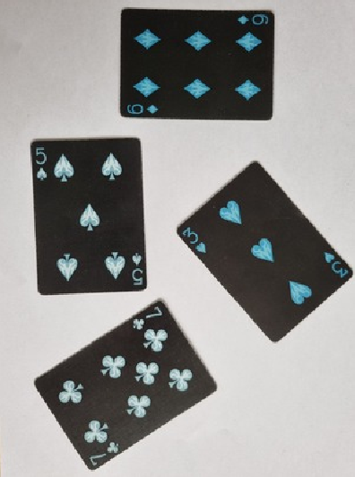

# Playing Card Identification

This project implements a **playing card identification system** using **MATLAB/Octave**. It leverages standard image processing techniques and algorithms to extract key information, including:

- Card numbers
- Card values
- Card positions (*used to display their value at the end*)

## 📦 Project Structure

```text
├── assets/             # Illustrations of the process
├── src/                # Functions and main program
|   └── samples         # Test image samples
├── flake.nix           # Nix environment
└── Makefile            # Automated testing and cleanup
```

## ⚙️ How it works

### Steps summary

|         Step 1 - Grey image         |     Step 2 - Black and White image      |
| :---------------------------------: | :-------------------------------------: |
|     |  |
|     **Step 3 - Dilated cards**      |      **Step 4 - Segmented cards**       |
|  |          |
|    **Step 5 - Dilated designs**     |     **Step 6 - Segmented designs**      |
|  |         |
|             **Result**              |           **Original image**            |
|       |       |

## 🧪 Test

### Install

### Run

## 📜 License

This project is licensed under the MIT License - see the [LICENSE](LICENSE) file for details.
